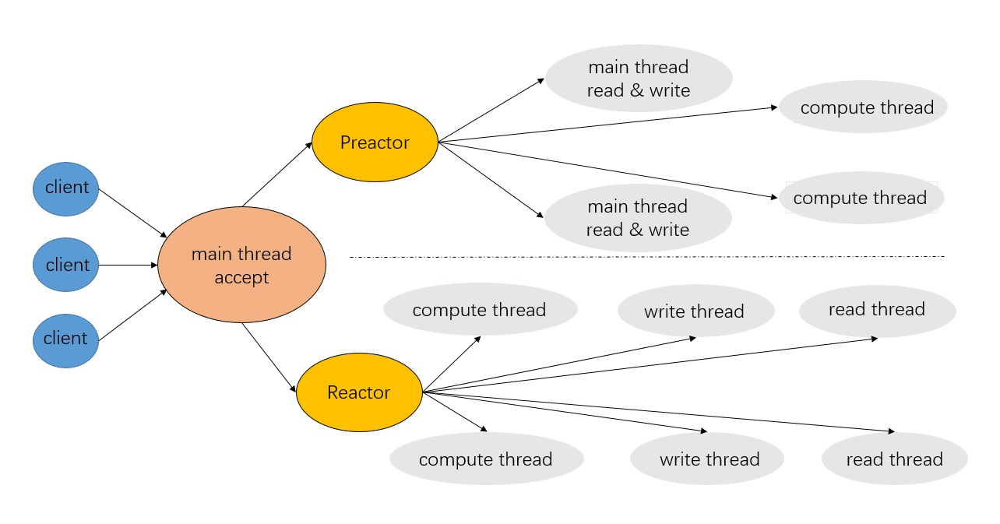

# A C++ webserver

## Introduction  

一个C++编写的Web服务器，解析http的GET、POST请求，支持访问数据库，支持HTTP长连接，同步异步日志，记录服务器运行状态

## Envoirment
* ubuntu 14+
* Chrome or Firfox
* Complier: g++ 4.8+
* MySql 5.7

## Model

并发模型为Reactor/Preactor+非阻塞IO+线程池

## Compile
    $ sudo apt install mysql-client mysql-server libmysqlclient-dev
	$ vim main.cpp # 修改passwd datebasename
    $ make server

## Usage

	./WebServer [-option value]
| option | value | default|
| :- | - | -: |
| p | 端口 | 9006 | 
| l | 同步日志0，异步日志1 | 0 |
| s | 数据库连接数 | 8 |
| t | 线程数 | 8|
| c | 关闭日志0，打开日志1 | 0|
| a | Preactor 0，Reactor 1 |0|

## Technical points
* 使用Epoll边沿触发的IO多路复用技术，非阻塞IO，Preactor与Reactor模式
* 使用多线程充分利用多核CPU，并使用线程池避免线程频繁创建销毁的开销
* 使用基于升序链表的定时器关闭超时请求
* 每个线程遵循one loop per thread原则
* 实现非阻塞模式下的ET和LT触发
* 使用请求队列实现异步日志任务和线程任务请求
* 部分类使用单例模式减少内存开销
* 使用状态机解析了HTTP的GET,POST请求
* 支持优雅关闭连接
* webbench测试达到上万条并发
